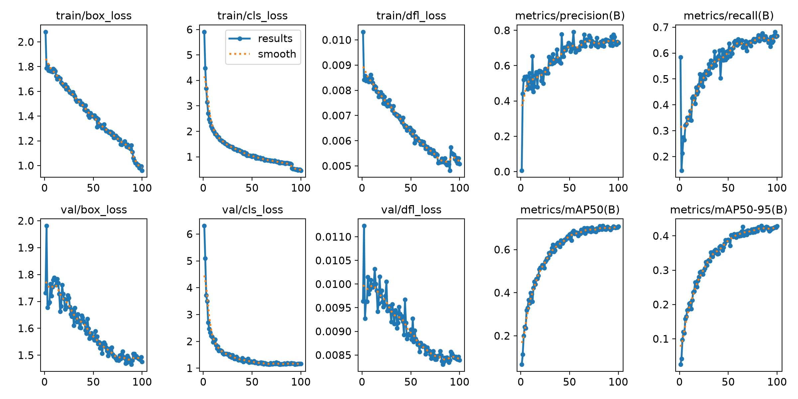
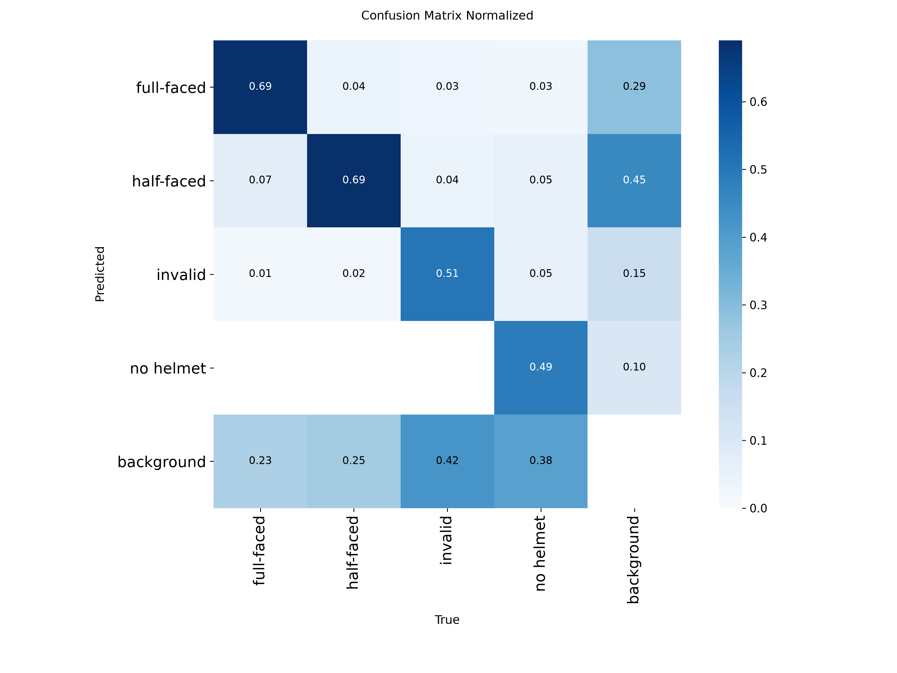

# Helmet Detector AI (YOLOv26)

An applied machine learning pipeline built to detect motorcycle riders and classify helmet usage directly from elevated traffic camera streams. The project utilizes the Ultralytics YOLO framework, managed via a modern, reproducible `uv` Python workspace.

## 📌 Project Overview & Operational Constraints

Unlike standard classification models that require manual image cropping, this pipeline operates as an **End-to-End Object Detection System**. It simultaneously handles bounding box localization ($x, y, w, h$) and multi-class classification (e.g., identifying specific attributes like full-faced helmets) directly from full-resolution frames.

### ⚠️ Important: Environment & Distribution Shift

- **Target Environment**: This model is trained explicitly on elevated, wide-angle CCTV/security intersection footage. It expects a high-angle perspective where motorcycles are small-to-medium objects within a wider traffic flow.
- **Known Limitations**: Due to Distribution Shift, the model will exhibit low confidence or fail entirely on close-up images (e.g., smartphone photos taken from a 2-meter distance) or highly contrasted close-up night shots. For maximum performance, deployment feeds must match the baseline CCTV viewpoint.

## 📂 Project Architecture

The repository enforces a clean separation of concerns between raw data, environment configurations, reusable utility code, and execution entry points:

```plaintext
helmet_detection/
├── config/
│   └── train_config.yaml         # Centralized hyperparameters dashboard
├── data/
│   └── dataset/                  # Native YOLO formatted data split
│       ├── train/                # Training images & bounding box labels
│       ├── valid/                # Validation / evaluation holdout
│       ├── test/                 # Test set for post-training verification
│       └── data.yaml             # Master dataset mapping (classes, paths)
├── runs/
│   └── detect/                   # Training artifacts & serialized weights (.pt)
├── src/
│   ├── __init__.py               # Marks directory as a python package
│   └── utils.py                  # Standalone helper functions and metrics
├── train.py                      # Training pipeline execution engine
├── evaluate.py                   # Quantitative metrics evaluation engine
├── inference.py                  # Production inference/prediction script
└── pyproject.toml                # Managed dependency manifest (PyTorch CUDA locked)
```

## 📊 Model Performance

### Training Results


### Confusion Matrix


## 🛠️ Setup & Installation

This project utilizes `uv` for blazing-fast package management and deterministic environment synchronization. It is locked to PyTorch with CUDA local GPU acceleration.

### Clone the Repository:
```bash
git clone https://github.com/ARefaat1/Helmet-detection.git
cd Helmet-detection
```

### Synchronize the Virtual Environment:
`uv` will automatically read the `pyproject.toml` file, set up a local virtual environment, and fetch the correct GPU-enabled PyTorch wheels directly from the isolated server index:
```bash
uv sync
```

## 🚀 How to Run

### 1. Training the Model
Hyperparameters are separated from the code logic. If you need to tweak the initial learning rate (`lr0`), change the batch size, or adjust real-world data augmentations (like shifting brightness `hsv_v` or enabling `mosaic`), edit `config/train_config.yaml`.

To launch the training pipeline on your local GPU:
```bash
uv run train.py
```
> **Note for Windows users:** The configuration defaults to `workers: 0` inside the training profile to prevent multi-threaded file-locking conflicts (`labels.cache` errors).

### 2. Evaluating the Model
To compute the final mAP on the hold-out test set and generate bounding boxes on the test images, simply run:
```bash
uv run evaluate.py
```

### 3. Running Inference on Personal Images
Drop your test images (CCTV or wide-angle street shots) into a folder named `test_images/` in the project root, then run the inference engine to generate predictions:
```bash
uv run inference.py
```
The model will load the finalized weights (`best.pt`) from the latest run, parse the images, and output annotated frames with tight bounding boxes and confidence parameters directly to `runs/detect/my_personal_tests/`.

## ✨ Sample Inference Results
The model demonstrates excellent bounding box localization and high confidence thresholds when processing native high-angle street configurations, gracefully filtering out stationary background vehicles (such as empty, parked scooters) to minimize industrial false-alarm triggers.